# Universal Translator Glasses (Software Track)

AI-powered ASL-to-text wearable system for hackathon delivery.

## 1) Project Goal

Build a software pipeline that:

1. Captures hand-sign video from a `Seeed Studio XIAO ESP32S3 Sense` camera module mounted on glasses.
2. Extracts structured hand movement features in real time.
3. Converts sign sequences into English text with low latency.
4. Streams translated text to a live web dashboard.

Primary demo target: continuous ASL-to-text captioning that feels near real time in a live conversation setting.

## 2) High-Level Architecture

The system uses a distributed setup so compute-heavy work stays off the microcontroller.

1. `XIAO ESP32S3 Sense` (on glasses): camera capture + lightweight Wi-Fi frame serving.
2. MacBook Air (M4): frame ingestion, MediaPipe processing, buffering, Gemini translation orchestration.
3. FastAPI backend (on laptop): APIs, ingest adapter, WebSocket broadcast, service coordination.
4. Next.js frontend: live transcript UI and system status display.

```mermaid
flowchart LR
  A["XIAO ESP32S3 Sense Camera Node"] -->|JPEG frames / MJPEG stream over Wi-Fi| B["FastAPI Ingest Adapter (Laptop)"]
  B --> C["MediaPipe Hands Tracker"]
  C -->|21x3 landmarks/frame| D["Temporal Buffer (1-2s windows)"]
  D --> E["Gemini 1.5 Flash Translation Service"]
  E -->|Text hypotheses + final text| F["FastAPI WebSocket Hub"]
  F --> G["Next.js Live Caption Dashboard"]
```

## 3) Why This Architecture

1. `XIAO ESP32S3 Sense` is ideal for low-power capture/streaming, not full CV + LLM inference.
2. Laptop offloading protects real-time performance for MediaPipe and Gemini calls.
3. Sending landmark JSON (instead of raw video) to Gemini reduces bandwidth, latency, and cost.
4. FastAPI + WebSocket gives low-latency push updates to the UI.

## 4) Core Software Components

### A. Camera/Firmware Node (`XIAO ESP32S3 Sense`)

Responsibilities:

1. Capture camera frames continuously.
2. Encode as JPEG and expose a stream endpoint over Wi-Fi.
3. Support reconnect behavior after transient network loss.
4. Emit minimal device health data (uptime, reconnect count, frame cadence).

Hackathon stream profile (starting baseline):

1. Resolution: `320x240` (primary), `640x480` optional for clarity testing.
2. Target camera output: `10-15 FPS` sustained on stable Wi-Fi.
3. Priority: low latency and consistency over image quality.

Device constraints to plan around:

1. Limited RAM/CPU compared with SBCs, so no on-device MediaPipe or LLM inference.
2. Wi-Fi jitter can be the dominant bottleneck.
3. Thermal/power conditions affect sustained frame cadence.

### B. Ingestion + Processing Node (FastAPI on Laptop)

Responsibilities:

1. Pull or subscribe to ESP32 camera stream (MJPEG/JPEG feed).
2. Decode frames and timestamp them on ingest.
3. Run MediaPipe Hands on incoming frames.
4. Normalize and serialize landmarks.
5. Maintain short rolling temporal buffer.
6. Route buffered sequences to translation service.
7. Publish incremental/final text updates to frontend.

### C. Landmark Extraction Layer (MediaPipe Hands)

Output per detected hand per frame:

1. 21 landmarks.
2. 3D coordinates `(x, y, z)`.
3. Confidence metadata for filtering.

Normalization strategy:

1. Normalize to wrist or palm reference to reduce camera-position dependence.
2. Apply scale-invariant transforms to improve signer robustness.
3. Apply temporal smoothing to reduce jitter in noisy frames.

### D. Translation Layer (Gemini 1.5 Flash)

Input:

1. Time-ordered landmark sequence over short windows (1-2 seconds).
2. Optional context from previous partial translation.

Output:

1. Partial hypotheses for live-caption feel.
2. Stabilized final text for transcript.

Prompting strategy:

1. Constrain the model to translation behavior only.
2. Prefer concise, plain English.
3. Require uncertainty handling (`[unclear]`) instead of hallucinated words.

### E. Frontend Layer (Next.js Dashboard)

Features:

1. Live caption text area (streaming updates).
2. Transcript history panel.
3. System health indicators (camera connected, ingest FPS, inference latency).
4. Manual controls (start/stop session, clear transcript).

## 5) End-to-End Data Flow

1. `XIAO ESP32S3 Sense` publishes camera frames over local Wi-Fi.
2. FastAPI ingest adapter receives/decodes frames.
3. MediaPipe Hands processes each eligible frame.
4. Landmark records are appended to a rolling buffer.
5. When a window threshold is met, buffered sequence is sent to Gemini.
6. Gemini returns translated text (partial/final).
7. FastAPI broadcasts updates via WebSocket to Next.js dashboard.
8. UI displays live captions and archives transcript entries.

## 6) Real-Time Targets (Hackathon KPIs)

1. Camera ingest FPS: `>= 12 FPS` sustained at `320x240`.
2. Landmark extraction latency: `<= 35 ms/frame` average on laptop.
3. Translation update cadence: every `1-2 seconds`.
4. End-to-end caption latency (gesture to text): `<= 3.0 seconds` (stretch goal `<= 2.0 seconds`).
5. Demo stability: `> 95%` uptime during a 10-minute live test.

## 7) Phase-by-Phase Delivery Plan

### Phase 1: ESP32S3 Sense Camera Bring-Up

Goal: stable `XIAO ESP32S3 Sense` camera feed to laptop.

Deliverables:

1. Firmware configured for reliable Wi-Fi camera streaming.
2. Verified stream endpoint(s) consumable by FastAPI ingest adapter.
3. Diagnostics for connection state, frame cadence, and reconnect behavior.

Exit criteria:

1. Continuous 10-minute camera stream without unrecoverable crash.
2. Automatic reconnect after temporary Wi-Fi interruption.

### Phase 2: Hand Tracking Pipeline

Goal: robust landmark extraction from ESP32 camera stream.

Deliverables:

1. MediaPipe integration on laptop ingest stream.
2. Serialized landmark output per frame.
3. Visual/log validation for landmark consistency.

Exit criteria:

1. Landmarks produced on most frames during signing.
2. Confidence filtering removes obvious false detections.

### Phase 3: Translation Integration

Goal: convert landmark windows into readable English text.

Deliverables:

1. Temporal buffer manager (1-2 second windows).
2. Gemini request/response orchestration.
3. Partial and final text update states.

Exit criteria:

1. Recognizable translations for a curated demo sign set.
2. Graceful handling of uncertain segments.

### Phase 4: Live Dashboard Experience

Goal: real-time user-facing caption UI.

Deliverables:

1. Next.js dashboard with live transcript.
2. WebSocket integration from FastAPI.
3. Session controls and health panel.

Exit criteria:

1. Full pipeline demo from hand signing to on-screen text.
2. Dashboard remains responsive under live stream load.

## 8) API and Interface Contract (Planned)

These interface definitions guide implementation and team alignment.

### Camera Source Interface (`XIAO ESP32S3 Sense` -> FastAPI Ingest)

1. Purpose: provide JPEG frame stream over LAN.
2. Required metadata at ingest: receive timestamp, frame index, source id.
3. Behavior: best-effort stream with dropped-frame tolerance and backpressure handling.

### Translation Interface (FastAPI -> Gemini Service Layer)

1. Purpose: submit buffered landmarks for inference.
2. Input: ordered landmark sequence + optional context id.
3. Output: partial/final text + confidence/status.

### WebSocket Channel (FastAPI -> Next.js)

Event types:

1. `caption.partial`
2. `caption.final`
3. `system.metrics`
4. `system.alert`

## 9) Reliability and Fallback Strategy

1. If network quality drops, lower resolution and/or requested frame rate.
2. If stream decode fails intermittently, skip bad frames and keep session alive.
3. If translation service delays, continue buffering and show `processing` state.
4. If hands are not detected, show explicit `No hands detected` status.
5. If Gemini is unavailable, preserve landmark logs for replay-based translation.

## 10) Performance Optimization Plan

1. Frame skipping: process every 2nd or 3rd frame when compute load spikes.
2. Adaptive ingest: dynamically tune frame size/quality to maintain steady latency.
3. Landmark-only cloud payloads: minimize request size and token overhead.
4. Optional single-hand mode during unstable network periods.
5. Queue limits and timeouts to prevent cascading lag.

## 11) Testing and Validation

### Functional Tests

1. ESP32 camera stream starts/stops cleanly.
2. Camera reconnect behavior works after Wi-Fi interruption.
3. Landmarks generate from known hand poses.
4. Translation responses match expected schema.
5. WebSocket events render correctly in dashboard.

### Integration Tests

1. End-to-end signing session from `XIAO ESP32S3 Sense` to UI.
2. Recovery after temporary camera or network interruption.
3. Stability over repeated start/stop cycles.

### Demo Validation Set

1. Prepare a fixed list of ASL signs/phrases for repeatable checks.
2. Measure caption latency and readability per phrase.
3. Record known failure cases for transparent demo communication.

## 12) Security and Privacy Notes

1. Keep camera-to-laptop traffic on trusted local network.
2. Do not persist raw video unless explicitly needed for debugging.
3. Prefer landmark logging over image logging.
4. Redact sensitive identifiers from logs before sharing.

## 13) Team Roles (Software)

Suggested division of responsibilities:

1. Embedded engineer: `XIAO ESP32S3 Sense` firmware + stream reliability.
2. CV engineer: MediaPipe tracking + feature normalization.
3. Backend engineer: FastAPI orchestration + WebSocket transport.
4. AI engineer: Gemini prompting + translation quality tuning.
5. Frontend engineer: Next.js live dashboard + UX polish.

## 14) Hackathon Execution Checklist

Before demo:

1. Validate Wi-Fi path between `XIAO ESP32S3 Sense` and laptop.
2. Confirm API keys and environment configuration.
3. Run a 10-minute soak test with live camera feed.
4. Warm up all services before judges arrive.
5. Keep a fallback replay path for resilience.

During demo:

1. Show live hand signing and real-time captions.
2. Briefly show ingest FPS + latency metrics to prove real pipeline.
3. Explain camera-frame to landmark-to-text efficiency strategy.

After demo:

1. Save logs and notes on translation misses.
2. Prioritize top 3 failure modes for next iteration.

## 15) Future Extensions

1. Add spoken-language translation pipeline (speech -> translated text/audio).
2. Add multilingual output mode.
3. Add edge-device model options for reduced cloud dependency.
4. Personalize signer profiles for improved translation quality.
5. Integrate audio output for accessibility scenarios.

## 16) Definition of Done (Hackathon Version)

Project is considered successful when:

1. Live ASL signing is captured through `XIAO ESP32S3 Sense` camera node.
2. Pipeline produces readable text with acceptable lag in real time.
3. Text appears continuously in Next.js dashboard via WebSocket.
4. Team can run the full demo reliably on command.

## 17) UI Design Source of Truth

The detailed website/UX plan for the live translation reader is documented in:

1. `UI_SPEC.md`

Use that file to drive frontend implementation before writing production UI code.

## 18) Backend Delivery Source of Truth

The backend phased execution plan and phase-completion tests are documented in:

1. `BACKEND_README.md`

Use that file to implement backend work phase by phase with objective completion checks.

---

This README defines the software implementation strategy and execution plan for the ESP32S3 Sense-based build. Code implementation will follow this document phase by phase.
